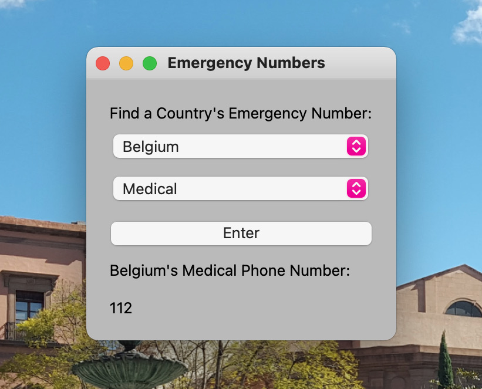
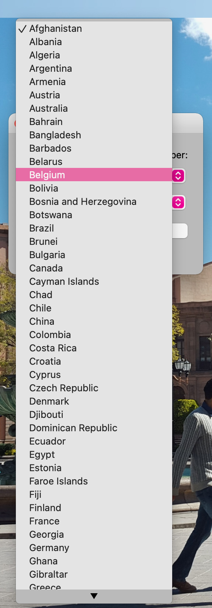

# countryEmergencyNums

**App Description:** countryEmergencyNums is a GUI application that outputs the emergency number of your choice (whether Police, Fire, or Medical) of a specific country of your choosing. This application was built using the <a href="https://github.com/BalestraPatrick/EmergencyAPI">EmergencyAPI</a>.

## Instructions to Run:
In order to run this app, it is best to have a virtual environment set up. Make sure to have requests and pySide6 installed in your virtual environment. Once you have all required documents in a directory, run the GUI App on your terminal. The python file you will need to run is countryNums.py.

### Steps:
Fork Repository -> git clone Repository -> Run in your virtual environment by typing: python countryNums.py

## Images:

